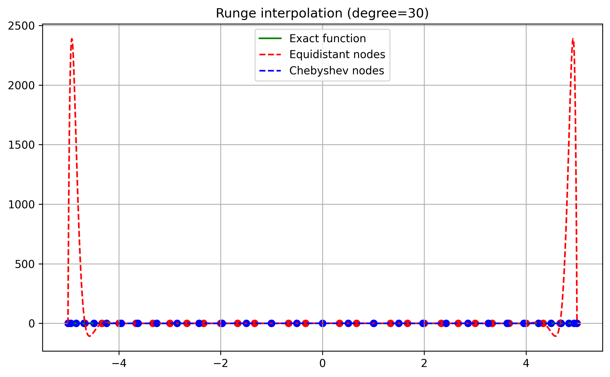
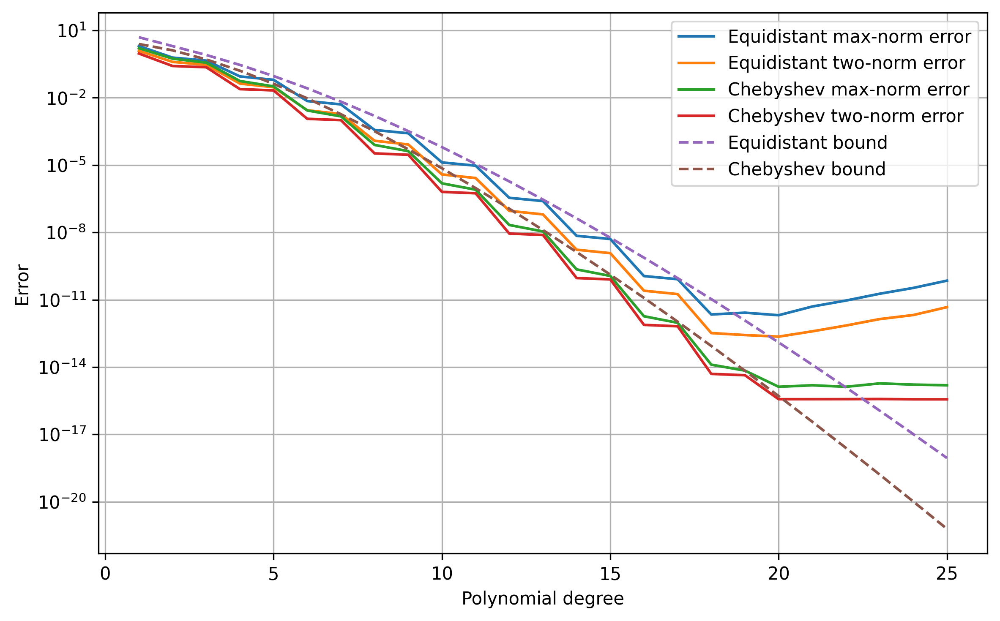
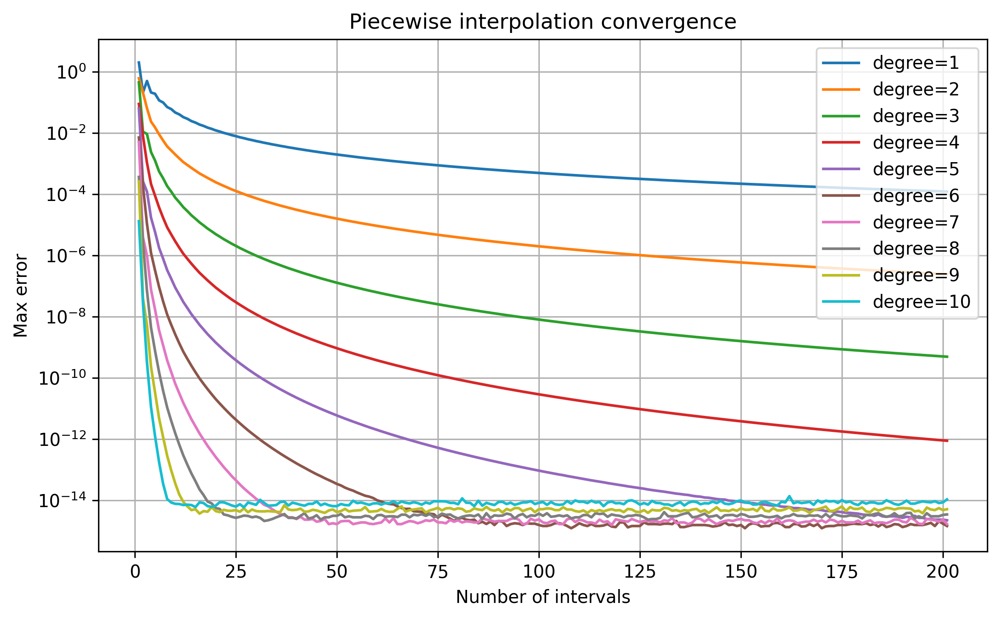
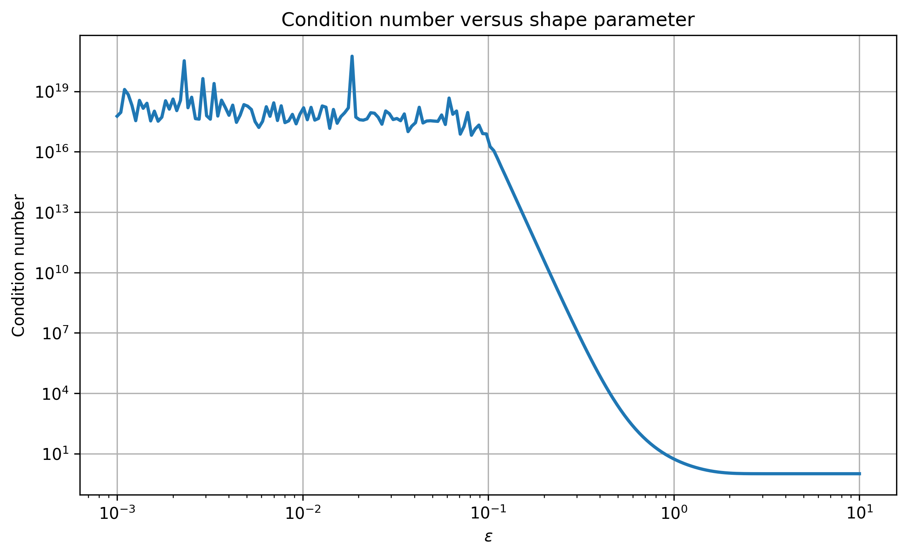
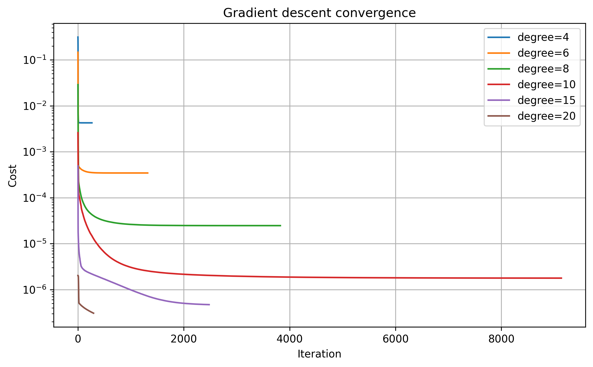

# Numerical Methods: Interpolation, Approximation and Optimization

This project explores interpolation and approximation methods from scientific computing and numerical analysis.

The project originated as coursework in scientific computing and numerical methods at NTNU, and was later refactored into a standalone repository with modular implementations, reproducible experiments and documented results.

Topics explored in the project include:

- Lagrange polynomial interpolation
- The Runge phenomenon
- Chebishev node distributions
- Error analysis and convergence
- Piecewise polynomial interpolation
- Radial Basis Function (RBF) interpolation
- Condition number analysis
- Automatic differentiation
- Gradient-based optimization

The implementation is written in Python using NumPy, Matplotlib and Autograd.

---

## Key Results

### The Runge Phenomenon



High-degree interpolation with equidistant nodes develops large oscillations near the interval boundaries, while Chebyshev nodes produce a significantly more stable approximation.

---

### Interpolation Error Analysis



Theoretical interpolation error bounds were compared with observed approximation errors for different polynomial degrees and node distributions.

---

### Piecewise Interpolation



Piecewise polynomial interpolation exhibits clear convergence as the number of subintervals increases. Higher polynomial degrees lead to significantly faster convergence rates.

---

### RBF Interpolation



Gaussian RBF interpolation provides accurate approximations, but the choice of shape parameter introduces an important trade-off between approximation quality and numerical stability.

---

### Optimization



Gradient descent with backtracking line search and automatic differentiation was used to optimize both interpolation nodes and RBF shape parameters.

---

## Repository Structure

```text
src/
    Core implementations

experiments/
    Reproducible experiments and figure generation

figures/
    Generated plots and tables

generate_figures
    Runs all experiments

report.md
    Full project report