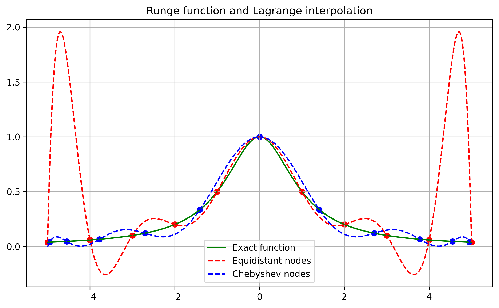
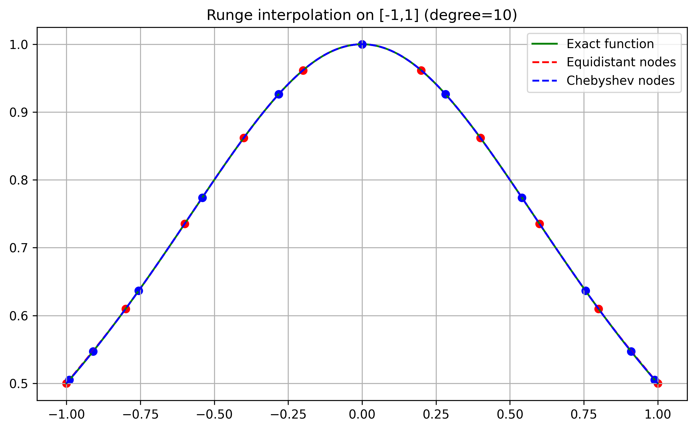
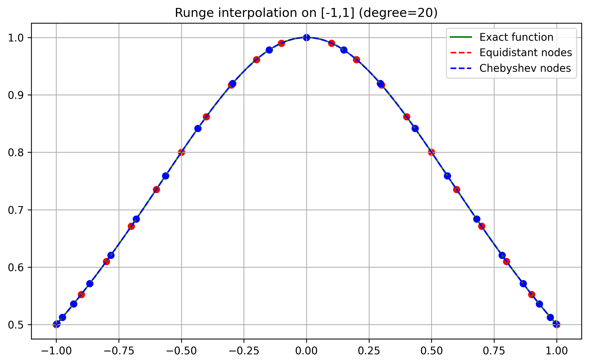
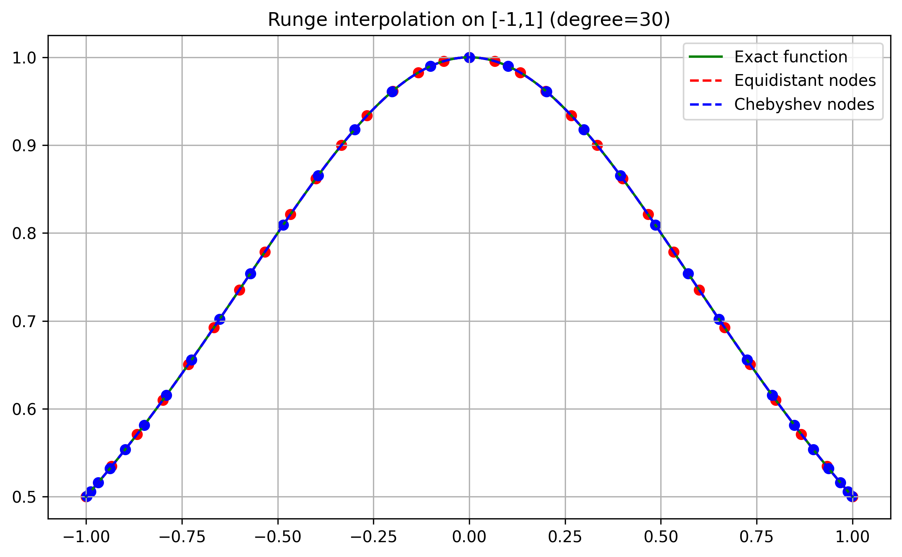
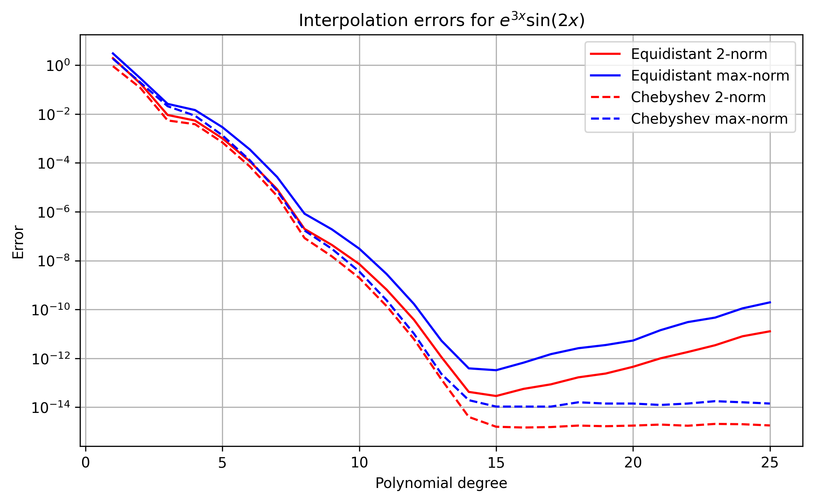
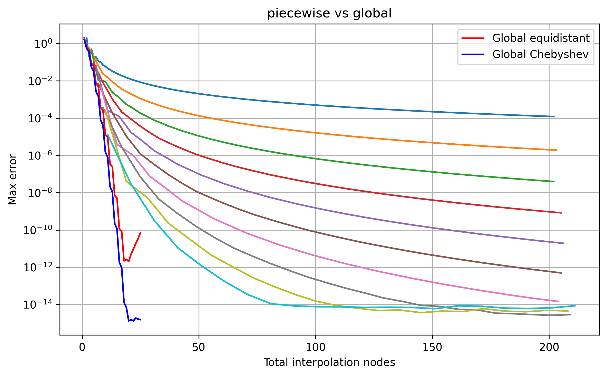
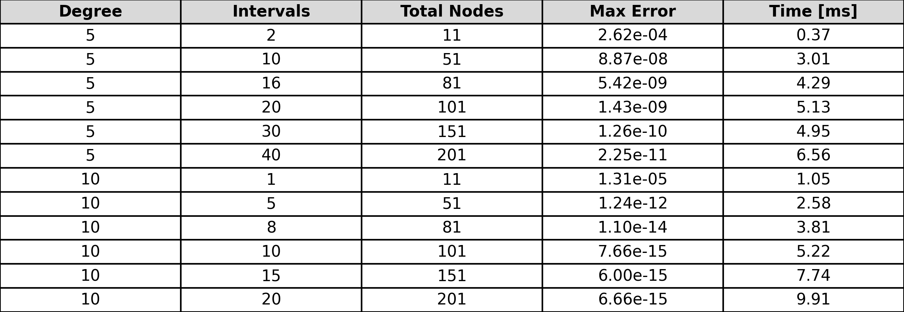
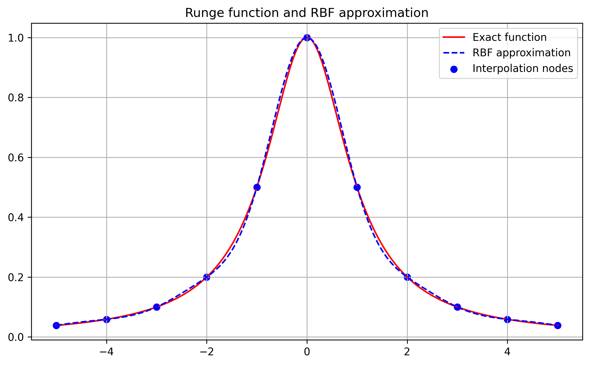
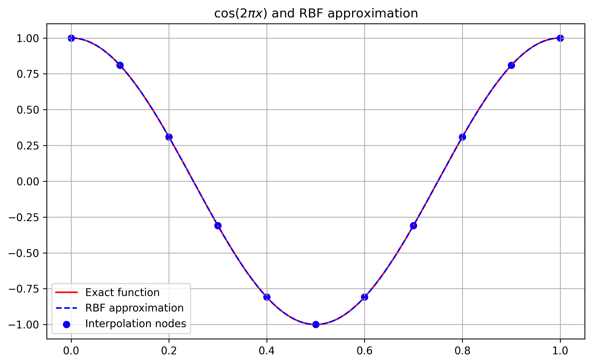
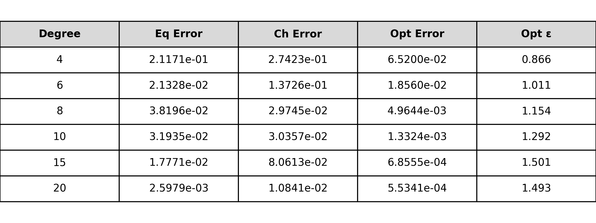

# Numerical Methods: Interpolation, Approximation and Optimization

## Introduction

This report investigates several numerical methods for approximation, interpolation and optimization. The work originated as a coursework project in scientific computing and numerical methods at NTNU. The main objective is to study how different approximation methods and parameter choices affect accuracy, convergence and numerical stability.

The report first considers polynomial interpolation, with particular focus on the Runge phenomenon and the effect of using equidistant versus Chebyshev nodes. Piecewise polynomial interpolation and radial basis function (RBF) interpolation are then investigated, including the effect of the RBF shape parameter on accuracy and numerical stability. Finally, optimization methods are used to investigate whether the interpolation nodes and RBF parameters can be improved.

The methods are implemented in Python using NumPy, Matplotlib and automatic differentiation. Most of the numerical implementations were developed as part of the project, while the gradient descent implementation used in the optimization section was provided as part of the original coursework. Numerical experiments are used throughout the report to compare the methods and relate the theoretical properties to their observed behaviour.

## Polynomial Interpolation and the Runge Phenomenon

As the polynomial degree increases, the difference between the two node distributions becomes increasingly pronounced. The interpolants based on equidistant nodes develop large oscillations near the endpoints of the interval, and these oscillations grow rapidly with increasing degree. In contrast, the interpolants based on Chebyshev nodes remain stable and continue to provide accurate approximations throughout the interval. These results demonstrate that interpolation accuracy depends not only on the polynomial degree, but also strongly on the placement of interpolation nodes. Increasing the degree alone does not guarantee improved accuracy.

In contrast to the interval $[-5, 5]$, it seems that the  Lagrange interpolation polynomial approximates the Runge function very well on $[-1, 1]$, for all three numbers of nodes and for both Chebishev and equidistant nodes. There appears to be something about the behaviour of the function near the $x=5$ and $x=-5$ that causes trouble.
For equidistant nodes on $[-5,5]$, the interpolation error grows dramatically near the endpoints as the degree increases, illustrating the Runge phenomenon. Chebishev nodes perform well on both intervals, although a larger number of nodes is required on $[-5,5]$ to achieve the same level of accuracy near the endpoints.

---

## Interpolation Error Analysis

To study the convergence of polynomial interpolation more rigorously, we analyse the classical interpolation error formula and compare theoretical error bounds with numerical results 

The interpolation error formula is given by: 
$\lvert f(x) - P_n(x) \rvert \le \frac{\max_{\xi \in [x_0,x_n]} \lvert f^{(n+1)}(\xi) \rvert}{(n+1)!} \, \biggl\lvert \prod_{k=0}^{n} (x - x_k) \biggr\rvert$ 
So for the approximation to converge in both 2-norm and max-norm, this formula has to go to zero as n goes to infinity. Therefore we find a limit for $f^{(n+1)}(\xi)$ for both functions first.

$f(x) = \cos(2\pi x)$ $\implies$ $\lvert f^{(n)}(\xi) \rvert \le (2\pi)^n $ as $|\cos(2\pi x+\varphi)| \le 1 $ $ \forall x \in [0, 1]$

  
$g(x) = e^{3x}\sin(2x)$  $\implies g^{(n)}(x) = \sum_{k=0}^{n} \binom{n}{k} \left(3^k e^{3x}\right) \left(2^{\,n-k}\sin (2x+\varphi_k)\right)$ $ \implies \bigl\lvert g^{(n)}(x) \bigr\rvert \le e^{3x} \sum_{k=0}^{n} \binom{n}{k} 3^k 2^{\,n-k}$

$ = e^{3x}(3+2)^n = e^{3x}5^n$ $\implies \bigl\lvert g^{(n)}(\xi) \bigr\rvert \le e^{3\pi/4}5^n $  $\forall \xi \in [0,\pi/4].$ 
 
Therefore both functions have errors of the form:  
$\lvert f(x) - P_n(x) \rvert \le \lambda \cdot \frac{\alpha^{\,n+1}}{(n+1)!} \biggl\lvert \prod_{k=0}^{n} (x - x_k) \biggr\rvert,$
 for constants $\lambda > 0$ og $\alpha > 0$.

Since $x_k$ and $x$ are in a closed interval, $\lvert x - x_k \rvert \le M$ $ \forall  k \implies$  
$\biggl\lvert \prod_{k=0}^{n} (x - x_k) \biggr\rvert \le M^{\,n+1} \implies$
$\lvert f(x) - P_n(x) \rvert \le \lambda \cdot \frac{(\alpha M)^{\,n+1}}{(n+1)!} \xrightarrow[n\to\infty]{} 0$

Since the error converges to $0$ in every $x$, it follows that the approximation converges both in max-norm: 
$\|f - P_n\|_\infty = \max_{x} \lvert f(x) - P_n(x) \rvert \to 0$  
and in 2-norm:  
$\|f - P_n\|_2 = \left(\int \lvert f(x) - P_n(x) \rvert^2 \, dx \right)^{1/2} \to 0$

Having established convergence theoretically, we now compare the observed interpolation errors with the corresponding error bounds.

The derivative bound $M=(2\pi)^{n+1}$ is the same for both node distributions and is independent of the choice of nodes. The difference between the bounds for equidistant and Chebishev nodes for the same (n) therefore comes from the nodal polynomial. This shows that the nodal polynomial varies significantly between the two node distributions.

For $n<20$, the tightness of the bound varies far more with the degree $n$ than with the choice of nodes. The ratio between the observed error and the bound varies considerably with the degree $n$, while the relative tightness is often quite similar for equidistant and Chebishev nodes.

There are two sources of the gap between the error bound and observed error. First, the maximum of $|f^{(n+1)}|$ is used instead of the actual value at the unknown point $\xi$. Second, the maximum of the nodal polynomial is used instead of the actual value at the point where the error is evaluated. Both are worst-case estimates and can therefore make the bound less tight.

Although the nodal polynomial differs significantly between equidistant and Chebishev nodes, the relative tightness of the bound is often quite similar. This suggests that the nodal polynomial is not the main source of the gap between the bound and the observed error

In addition, there seems to be a correlation between $n$ and how tight the bound is, it is much tighter for odd $n$ than for even $n$. We know that $|f^{(n+1)}|$ has a phase shift of $pi/2$ between odd and even $n$, while $M$ remains unchanged. The location of the maximum derivative therefore shifts with the phase. This also suggests that the gap between the bound and the observed error can be explained by the use of the bound M

Finally, the theoretical bound does not bound the observed error for large $n$. For Chebishev nodes, the error approaches machine precision, approximately $10^{-15}$ for double representation. For equidistant nodes, the error eventually starts to increase as (n) increases. This is due to numerical instability of the Lagrange interpolation with equidistant nodes, including cancellation and round-off errors. Therefore the error for large $n$ is caused by numerical rounding errors rather than a failure of the theoretical error bound.

---

## Piecewise Polynomial Interpolation

To investigate local polynomial approximation, the interpolation interval was subdivided into multiple subintervals and a polynomial interpolant was constructed on each interval.

To provide numerical evidence of convergence as K approaches infinity, we analyze the max-norm error curves for polynomial degrees $n = 1, 2, ..., 10$. The error curves show a steady and predictable decline on the logarithmic scale for all degrees as the number of subintervals increases. This demonstrates that dividing the domain into smaller intervals reduces the interpolation error, confirming numerical convergence. 

For $\cos(2\pi x)$, both global Chebishev and piecewise interpolation achieve errors close to machine precision. For example global Chebishev interpolation reaches an error of $1.33\cdot10^{-15}$ with 20 nodes and 10-degree piecewise method reaches $1.10\cdot10^{-14}$ with 81 nodes.

The global equidistant method initially achieves low errors, but becomes unstable as the number of nodes increases. The error increases from $2.05\cdot10^{-12}$ with 20 nodes to $7.12\cdot10^{-11}$ with 25 nodes.

The measured computational times show that piecewise interpolation and global Chebishev nodes achieve machine precision with similar computational cost. However, for this smooth test function global Chebishev interpolation attains a smaller error using fewer nodes. Combined with its slightly lower computational cost, this makes global Chebishev interpolation the most efficient method for this particular test function.

On the other hand, piecewise interpolation offers greater flexibility because it is easy to increase the number of intervals in regions where better accuracy is needed. Piecewise interpolation may therefore be preferable for more complicated functions.

---

## Radial Basis Function Interpolation

In addition to polynomial interpolation, Gaussian Radial Basis Function (RBF) interpolation was investigated. Unlike polynomial interpolation, the approximation is constructed as a weighted sum of basis functions centred at the interpolation nodes.

The plot demonstrates that the condition number $cond(M)$ increases exponentially as $\varepsilon$ decreases below 1. Around $\varepsilon \approx 0.1$, the condition number becomes so large that round off errors dominate for standard double-precision floats. For $\varepsilon < 1$, the system becomes  ill-conditioned, and the oscillations on the curve show where the rounding errors start to take over and ruin the solution. This behavior highlights the fundamental trade-off in RBF interpolation, a smaller $\varepsilon$ flattens the basis functions and theoretically improves the mathematical fit, it makes the interpolation matrix more singular, which again makes the computed solution numerically unstable.

This was also consistent with the values of $\varepsilon$ tested by trial and error. For large values of $\varepsilon$, the approximation quality was poor, while for small values of $\varepsilon$ the plot became unstable due to ill-conditioning. The choice $\varepsilon = 1$ provided a reasonable balance between accuracy and numerical stability. Therefore, a good choice of $\varepsilon$ must balance these two competing effects.

---

## Optimization of Node Locations and Shape Parameters

Since the performance of RBF interpolation depends strongly on both node placement and the shape parameter ε, it is natural to ask whether these quantities can be optimized directly.

The table above shows the 2-norm error for RBF interpolation using equidistant nodes, Chebishev nodes and optimized nodes. It is clear that the gradient descent algorithm successfully minimizes the cost function, the error is significantly smaller than both the equidistant and Chebishev errors. In addition it is the only one of the three where the error decreases for every step, this is because, as we can tell by the optimized $\varepsilon$, the optimal $\varepsilon$ varies. Because of this we canno t tell if equidistant or Chebishev nodes are better from this table, this depends strongly on whether $\varepsilon = 1$ is a good guess for the type and number of nodes. The difference between equidistant and Chebishev nodes is less clear for RBF interpolation than for polynomial interpolation. The optimized node locations and shape parameter appear to have a larger impact on the error than the initial choice between equidistant and Chebyshev nodes.

Until $n=10$, the optimized error decreases rapidly as the number of nodes increases. The improvement continues for larger values of $n$, but the reduction becomes much smaller between $n=15$ and $n=20$. At the same time, the optimized value of $\varepsilon$ stabilizes around 1.5. This suggests that further reductions in the error cannot be achieved simply by adjusting the shape parameter, and that other factors begin to limit the accuracy of the approximation.

The optimized nodes are obtained by minimizing the discrete 2-norm error directly. Unlike the equidistant and Chebishev distributions, the optimized node locations depend on the function being approximated. This gives the method greater flexibility, since the node distribution can adapt to the specific behaviour of the function rather than being predefined.

Overall, the optimization-based approach consistently produced the smallest errors of the three methods considered. This increased accuracy comes at the cost of solving a significantly more complicated optimization problem, making the method computationally more expensive than simply using equidistant or Chebishev nodes.

---

## Best Approximation and Least Squares

The final part of the project investigates the relationship between optimal interpolation nodes and classical least-squares approximation.

The best approximation polynomial of degree $n$, $q_n$, is equal to the interpolation polynomial $p_n$ on the optimal set of nodes for this cost function.

Both $q_n$ and $p_n$ are polynomials of degree at most $n$. Since $q_n$ minimizes the cost function over all polynomials of degree $n$, we have $C(q_n)\leq C(p_n)$

The task states that the interpolation nodes are chosen such that $C(p_n)$ is minimized. The interpolation polynomial computed from $n+1$ distinct nodes can represent all polynomials of degree $\le n$. Therefore, minimizing over the node locations is equivalent to minimizing over all interpolation polynomials of degree at most $n$. Since $q_n$ is one such polynomial, the optimal interpolation polynomial must satisfy  

$C(p_n)\leq C(q_n)$

Therefore 

$C(p_n)=C(q_n)$

Since the least-squares best approximation polynomial is unique, it follows that $p_n=q_n$

Because of this equivalence, it is possible to find $p_n$ without interpolating. From the task, we observe that the cost function $C(x)$ is a constant multiple of the discrete least-squares error. Therefore, it is sufficient to minimize the discrete least-squares error $L$. 
$p_n = q_n = \sum_{i=0}^nc_ix^i$  where the coefficients $c_i$ are chosen to minimize $L$

Thus, $p_n$ can be computed directly as a least-squares polynomial, without first finding interpolation nodes: 
$L(c_0, c_1, ..., c_n) = \sum_{k=0}^N(f(\eta_k)-p(\eta_k))^2$  
$\nabla L = 0$  
This gives a system of equations for the coefficients $c_i$, which can be solved to obtain $p_n$.

---

## Conclusion

This project investigated polynomial interpolation, piecewise interpolation, RBF interpolation and optimization-based methods.

The experiments reproduced classical numerical phenomena such as the Runge phenomenon and demonstrated the benefits of Chebyshev nodes, piecewise methods and optimized node placement. In addition, the results highlighted the trade-off between approximation accuracy and numerical stability in RBF interpolation.

Overall, the project illustrates how interpolation quality depends not only on the approximation method itself, but also on node placement, parameter selection and numerical stability considerations.